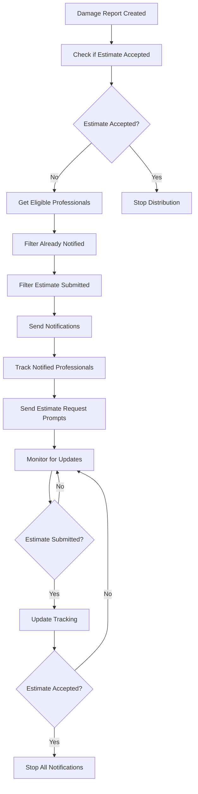

# Real-Time Distribution System for Vehicle Damage App

## 🚀 Overview

This system provides real-time distribution of damage reports and estimate requests to repair professionals using Firebase Cloud Messaging (FCM), Firestore listeners, and intelligent request management.

## ✨ Key Features

### **Real-Time Push Notifications**
- **Instant Broadcasting**: Damage reports are pushed to eligible professionals immediately upon creation
- **Smart Targeting**: Only relevant professionals receive notifications based on availability and expertise
- **Duplicate Prevention**: Intelligent routing prevents duplicate notifications to the same professional

### **Estimate Request Management**
- **Automatic Requests**: Professionals receive prompts to submit estimates for new damage reports
- **Status Tracking**: System tracks which professionals have been notified and which have submitted estimates
- **Request Cessation**: Stops sending requests once an estimate is accepted

### **Offline Support**
- **Queue Management**: Updates are queued when connectivity is lost
- **Automatic Sync**: Queued updates are processed when back online
- **Resilient Operation**: System continues to function seamlessly during connectivity issues

## 🏗️ Architecture

### **Core Services**

#### 1. **NotificationService** (`lib/services/notification_service.dart`)
- Manages Firebase Cloud Messaging (FCM) integration
- Handles local notifications for foreground/background states
- Manages notification channels and permissions
- Stores FCM tokens in user profiles

#### 2. **RealTimeDistributionService** (`lib/services/real_time_distribution_service.dart`)
- Core distribution logic for damage reports
- Manages Firestore listeners for real-time updates
- Tracks notification and estimate submission status
- Handles offline queue management
- Prevents duplicate notifications

#### 3. **RealTimeDashboard** (`lib/widgets/real_time_dashboard.dart`)
- Professional-facing real-time dashboard
- Live updates for damage reports and estimates
- Analytics and distribution status
- Quick actions for estimate submission

## 🔧 Implementation Details

### **Real-Time Distribution Flow**



### **Notification Types**

1. **New Damage Report** 🚗
   - Title: "New Damage Report Available"
   - Body: Vehicle info + damage description
   - Channel: `damage_reports`

2. **Estimate Request** 📋
   - Title: "Submit Estimate Request"
   - Body: Prompt to submit estimate
   - Channel: `estimate_requests`

3. **Estimate Update** ✅
   - Title: "Estimate Accepted!" / "Report No Longer Available"
   - Body: Status update information
   - Channel: `estimate_updates`

### **Smart Distribution Logic**

```dart
// Get eligible professionals for a damage report
Future<List<String>> _getEligibleProfessionals(String reportId) async {
  // 1. Get all available repair professionals
  // 2. Filter out already notified professionals
  // 3. Filter out professionals who already submitted estimates
  // 4. Return eligible list
}
```

### **Offline Queue Management**

```dart
// Add action to offline queue
void _addToOfflineQueue(String action, Map<String, dynamic> data) {
  _offlineQueue.add({
    'action': action,
    'data': data,
    'timestamp': DateTime.now().millisecondsSinceEpoch,
  });
}

// Process queue when back online
Future<void> _processOfflineQueue() async {
  // Process all queued actions
  // Re-add failed items for retry
}
```

## 📱 User Experience

### **For Vehicle Owners**
- **Instant Professional Matching**: Damage reports are immediately distributed to relevant professionals
- **Faster Response Times**: Professionals receive real-time notifications
- **Better Estimate Quality**: Multiple professionals can compete for the job

### **For Repair Professionals**
- **Live Dashboard**: Real-time view of available damage reports
- **Instant Notifications**: Get notified immediately when new reports are available
- **Smart Request Management**: No duplicate notifications or unnecessary requests
- **Offline Support**: Continue working even without internet connection

## 🚦 Setup Instructions

### **1. Dependencies**
Add to `pubspec.yaml`:
```yaml
dependencies:
  firebase_messaging: ^15.1.3
  connectivity_plus: ^6.0.4
  flutter_local_notifications: ^18.0.0
```

### **2. Firebase Configuration**
- Enable Firebase Cloud Messaging in Firebase Console
- Configure FCM for Android and iOS platforms
- Set up notification channels

### **3. Platform-Specific Setup**

#### **Android**
- Add FCM permissions to `android/app/src/main/AndroidManifest.xml`
- Configure notification icons and channels

#### **iOS**
- Add notification capabilities in Xcode
- Configure background modes for notifications

### **4. Initialize Services**
```dart
// In your app initialization
final realTimeService = RealTimeDistributionService();
await realTimeService.initialize();
```

## 🔒 Security Considerations

### **Access Control**
- Only authenticated professionals receive notifications
- Professionals can only see reports they're eligible for
- Estimate submission requires proper authentication

### **Data Privacy**
- FCM tokens are stored securely in user profiles
- Notification data is minimal and necessary
- No sensitive information in push notifications

### **Rate Limiting**
- Prevents notification spam
- Respects professional availability settings
- Intelligent backoff for failed deliveries

## 📊 Performance Optimization

### **Efficient Queries**
- Use Firestore indexes for complex queries
- Implement pagination for large result sets
- Cache frequently accessed data

### **Notification Batching**
- Group notifications when possible
- Use topics for broadcast notifications
- Implement smart delivery timing

### **Offline Optimization**
- Queue management with priority levels
- Selective sync based on importance
- Background processing for non-critical updates

## 🧪 Testing

### **Unit Tests**
```dart
test('should notify eligible professionals for new damage report', () async {
  // Test notification logic
});

test('should prevent duplicate notifications', () async {
  // Test duplicate prevention
});

test('should handle offline scenarios', () async {
  // Test offline queue management
});
```

### **Integration Tests**
- Test FCM integration
- Test Firestore listeners
- Test notification delivery

### **Performance Tests**
- Test with large numbers of professionals
- Test notification delivery times
- Test offline queue processing

## 🚀 Deployment

### **Pre-Deployment Checklist**
- [ ] FCM configuration verified
- [ ] Notification channels configured
- [ ] Firestore indexes created
- [ ] Security rules updated
- [ ] Offline queue tested
- [ ] Performance benchmarks established

### **Monitoring**
- Track notification delivery rates
- Monitor FCM token refresh
- Watch for failed deliveries
- Monitor offline queue sizes

## 🔮 Future Enhancements

### **Advanced Features**
- **Geographic Matching**: Match professionals by location
- **Skill-Based Routing**: Route reports based on professional expertise
- **Priority Queuing**: Handle urgent reports with higher priority
- **Analytics Dashboard**: Professional performance metrics

### **Integration Opportunities**
- **SMS Fallback**: Send SMS when push notifications fail
- **Email Integration**: Email notifications for important updates
- **Calendar Integration**: Schedule estimate deadlines
- **Payment Integration**: Handle estimate payments

## 📞 Support

### **Common Issues**
1. **Notifications not received**: Check FCM configuration and permissions
2. **Offline queue not processing**: Verify connectivity monitoring
3. **Duplicate notifications**: Check distribution logic and tracking

### **Debug Tools**
```dart
// Check distribution status
final status = realTimeService.getDistributionStatus(reportId);
print('Distribution Status: $status');

// Manually trigger distribution
await realTimeService.manuallyDistributeReport(reportId);
```

## 📚 Additional Resources

- [Firebase Cloud Messaging Documentation](https://firebase.google.com/docs/cloud-messaging)
- [Flutter Local Notifications](https://pub.dev/packages/flutter_local_notifications)
- [Connectivity Plus Package](https://pub.dev/packages/connectivity_plus)
- [Firestore Real-time Updates](https://firebase.google.com/docs/firestore/query-data/listen)

---

**Note**: This system is designed to be scalable and maintainable. The modular architecture allows for easy extension and modification as requirements evolve.

